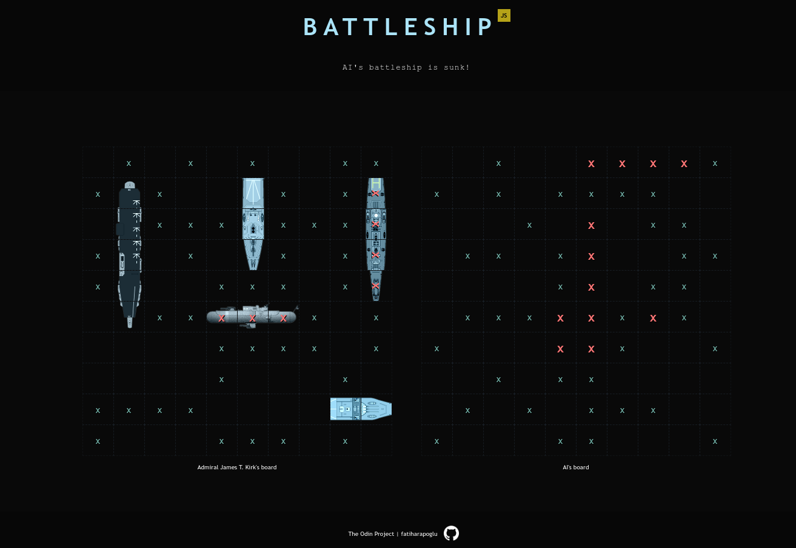

# Weather API

Created with **HTML**, **SCSS** and **JavaScript**.

⮕ [Live preview](https://fatiharapoglu.github.io/battleship/)

## Features

-   Smart AI that plays similarly to a human, also without cheating.
-   Ship placement supports drag and drop for better user experience.
-   Announcer text that helps and informs you with certain situations.
-   Snackbar alerts when there is an error or warning.
-   Special texts such as when first ship is sunk and the game is over.

## Helper Dependencies

-   [Webpack](https://webpack.js.org/) for bundling
-   [Jest](https://jestjs.io/) for testing
-   [Interact.js](https://interactjs.io/) for drag & drops
-   [Sass](https://sass-lang.com/) for SCSS
-   [Eslint](https://eslint.org/) for linting
-   [Prettier](https://prettier.io/) for formatting

## Roadmap

-   Make design responsive.

## How It Looks

